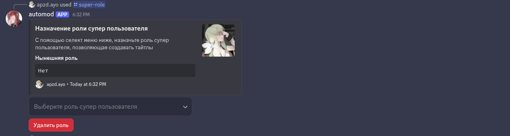
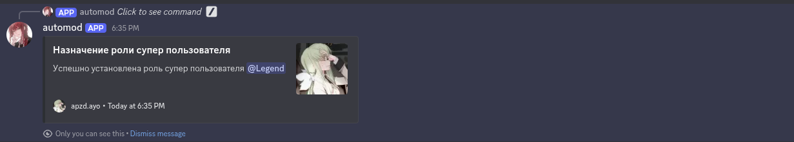
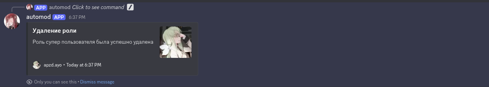
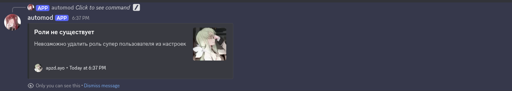
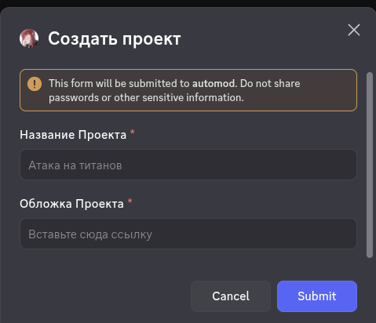
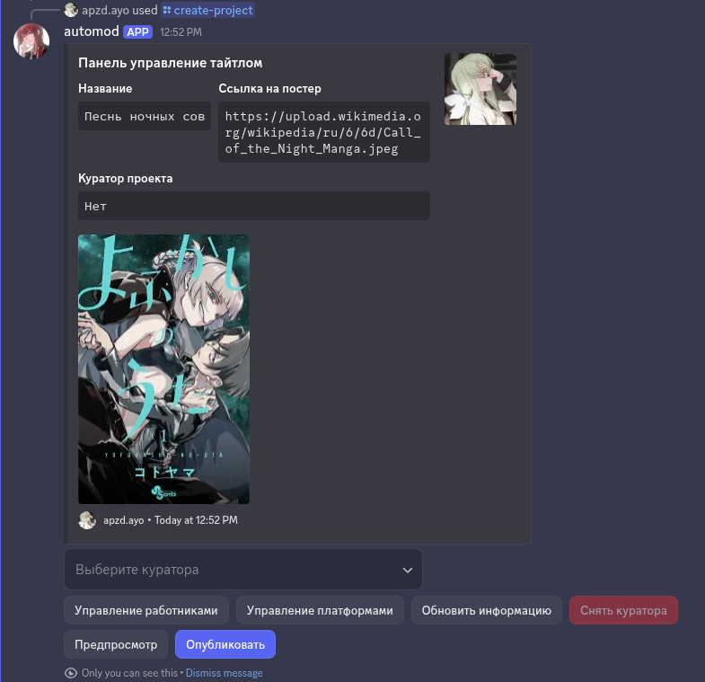

# DIT-TEST

Тестовое задание от сервера https://discord.gg/diti

## Терминология

Супер пользователь - человек, что имеет право создавать тайтлы и назначать куратора на них  
Проект - манга, манхва, маньхуа  
Куратор - ответственный за тайтл человек  

## Команды

| Название       | Описание                                                                            | Права              | Тип             |
| -------------- | ----------------------------------------------------------------------------------- | ------------------ | --------------- |
| super-role     | Позволяет назначить роль, что способна создавать проекты и назначать кураторов туда | Администраторы     | Слэш            |
| create-project | Позволяет назначить роль, что способна создавать проекты и назначать кураторов туда | Супер пользователь | Слэш            |
| update-project | Позволяет назначить роль, что способна создавать проекты и назначать кураторов туда | Куратор            | Слэш + Контекст |

## super-role

Команда позволяет назначить роль супер пользователя с помощью селект меню!

1. Приветственный эмбед:
   

2. Эмбед назначенной роли (успех):
   

3. Эмбед назначенной роли (провал):
   ](screnshots/super-role-assign-error.png)

4. Удаление роли (успех):
   

5. Удаление роли(провал):
   

## create-project

Команда позволяет супер-пользователю создать новый проект

1. Модальное окно с созданием проекта
   

> Важно

Ссылка на обложку проверяется не как регулярное выражение, а как полноценное изображение, из-за чего процесс валидации чуть дольше

### Панель управления

Управление куратором проекта:  
1. Выберите куратора - позволяет назначить куратора на проект(доступно только супер пользователю, если куратор есть, то кнопка недоступна в любом случае)
2. Снять куратора - позволяет убрать куратора с проекта (доступно только супер пользователю, если куратора нет, то кнопка недоступна в любом случае)

Управление публикацией:  
1. Предпросмотр - позволяет увидеть как будет выглядеть итоговое сообщение
2. Опубликовать - позволяет опубликовать в канал по выбору (если сообщение уже опубликовано, опция сменится на обновление)

Обновить информацию:  
Кнопка позволяет обновить название/обложку проекта
