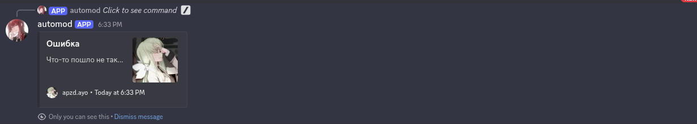

# DIT-TEST

Тестовое задание от сервера https://discord.gg/diti

## Терминология

Супер пользователь - человек, что имеет право создавать тайтлы и назначать куратора на них
Проект - манга, манхва, маньхуа
Куратор - ответственный за тайтл человек

## Команды

| Название       | Описание                                                                            | Права              |
| -------------- | ----------------------------------------------------------------------------------- | ------------------ |
| super-role     | Позволяет назначить роль, что способна создавать проекты и назначать кураторов туда | Администраторы     |
| create-project | Позволяет назначить роль, что способна создавать проекты и назначать кураторов туда | Супер пользователь |

## super-role

Команда позволяет назначить роль супер пользователя с помощью селект меню!

1. Приветственный эмбед:
   

2. Эмбед назначенной роли (успех):
   

3. Эмбед назначенной роли (провал):
   ](screnshots/super-role-assign-error.png)

4. Удаление роли (успех):
   

5. Удаление роли(провал):
   

## create-project
